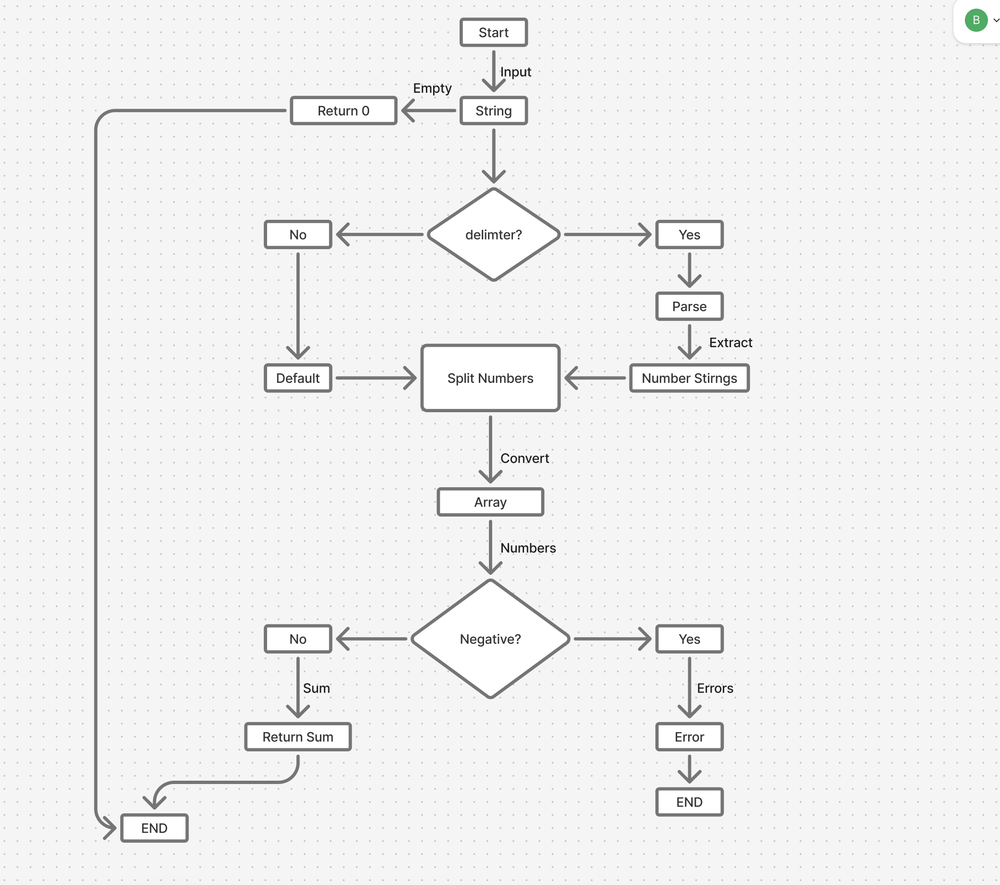
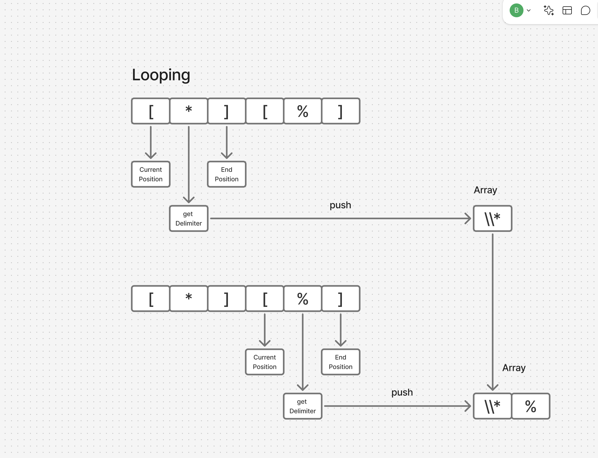

# tdd-kata

String Calculator

## Install dependencies and run the test
```bash
npm install
npm run test
```
## Flow Diagram using FigJam board



## Test Case Table 

| Add              | Input | output |
| :---------------- | :------: | ----: |
| should return 0 for an empty string        |   ''   | 0 |
| Single number returns the value           |   '1'   | 1 |
| Two numbers comma delimited returns the sum |  '1, 2'   | 3 |
| Handle any amount of numbers |  '1,2,3,4,5'   | 15 |
| Handle new lines between numbers |  '1\n2,3'   | 6 |
| Support different delimiters |  '//;\n1;2'   | 3 |
| Negative numbers throw an exception |  '1,-2,3'   | negative numbers not allowed |
| should handle multiple delimiters |  '//[*][%]\n1*2%3'   | 6 |
| Support different delimiters |  '//[***]\n1***2***3'   | 6 |
| Support different delimiters |  '//[**][%%]\n1**2%%3'   | 6 |

## Multiple delimiters Loop Logic


